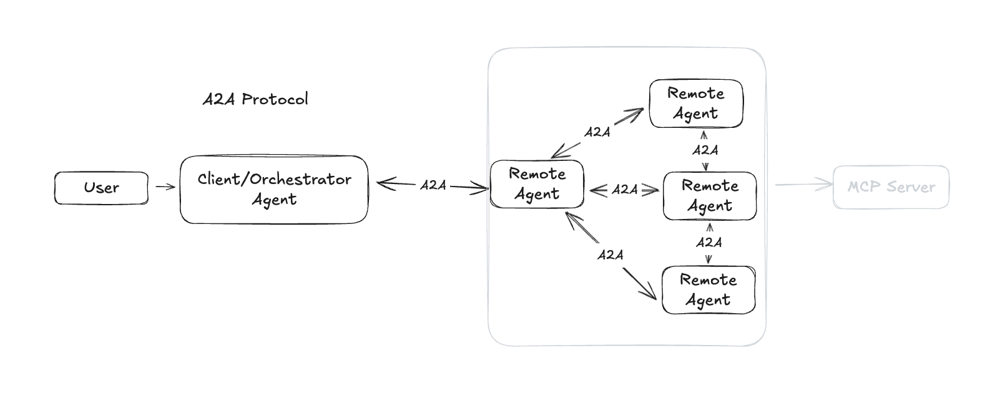
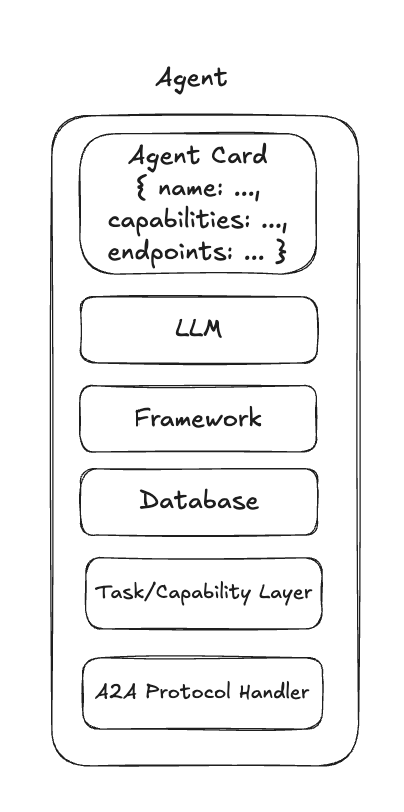

# A2A Architecture Diagrams

## High-Level A2A Protocol Flow 
*Note: I drew this for my own understanding*

A2A protocol enables a client/orchestrator agent to communicate with one or more remote agents, which may themselves coordinate with other agents. This enables distributed, multi-agent workflows. MCP can (optionally) be used to call tools from the remote agents. 

*Note 2: I do not explore MCP in the context of this repo.*

## Agent Internal Structure
*Note: I drew this for my own understanding*

Each agent exposes an Agent Card and is composed of a protocol handler, task/capability layer, and may include LLMs, frameworks, and databases as needed.

